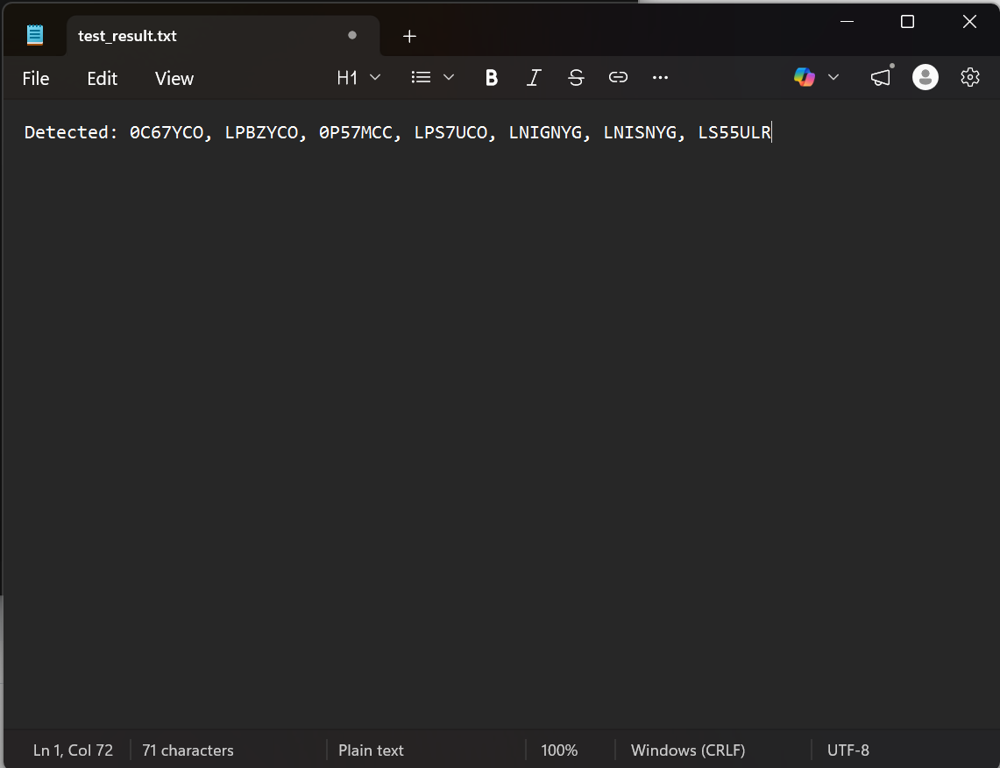

# License_PlateNumber_Detection

A Python-based Automatic Number Plate Recognition (ANPR) system that utilizes **YOLO** for object detection and **EasyOCR** for character recognition. This project processes video files, detects license plates, and filters results based on regional formatting (Europe/Philippines).

---

## 🎬 Demo

### GIF Demo


### Screenshot Result


---

## 🚀 Features

* **YOLO Integration:** Uses a custom-trained YOLO model to locate license plates.

* **EasyOCR Processing:** Extracts alphanumeric text from detected regions.

* **Regional Validation:** Specialized logic to validate plate formats for:

  * **Europe:** 7-character alphanumeric strings.

  * **Philippines:** 7-character strings (Standard **LLL-NNNN** or **NNN-LLLL** formats).

* **Frame Scaling:** Automatically calculates scale ratios to crop high-resolution plates from resized inference frames.

* **Data Export:** Saves unique detected plate numbers to a `.txt` file.

---

## 🛠️ Requirements

You will need **Python 3.8+** and the following libraries:

```bash
pip install ultralytics opencv-python easyocr
